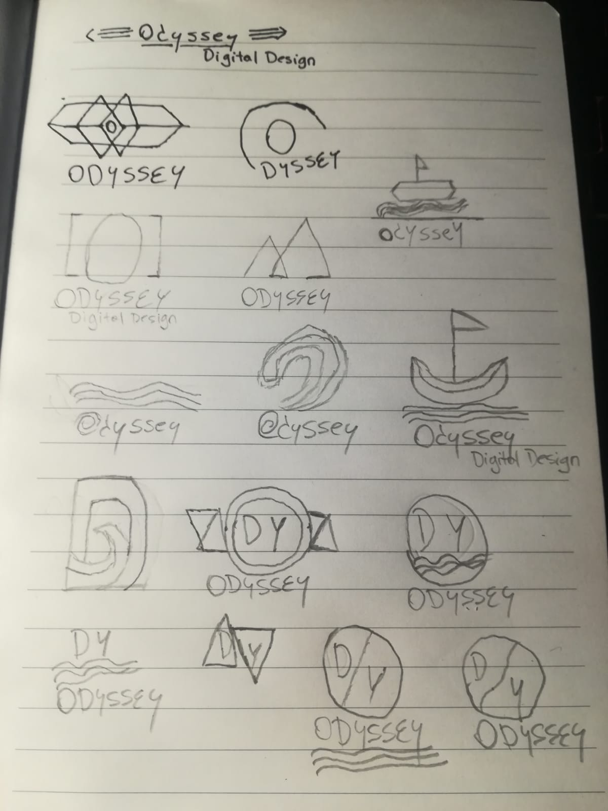

## Digital Creativity Assessment

A brand needs to have its own identity, be recognizable just from a glance. To use those concepts I started by following important steps until I reach what I intended.

## Research

When it comes to researching for ideas to create a logo, there is a whole lot of countless brands to take inspiration from. What I am aiming for is to assimilate a name to an image/shape that is memorable to the user. Some companies already perfectly do these. Lets take **Twitter** as an example, **Twitter** is often associated with a bird, why? because of its very recognizable logo. If one day they decided to change it, users would get very confused since the bird is the company identity.

A lot of brainstorming was necessary to find a fitting name for a Digital Design company. That was until I associated what exactly a digital designer is with an already existent word. And that being __Odyssey__ , honestly, as a designer, we always wander through our thoughts to expand our ideas to satisfy our customers, the word itself is very memorable and usually associated with going on adventures, which can possibly also be one of the slogans for the company. 

After thinking of a name for the company, I used https://www.logodesignlove.com/, logodesignlove.com/yukio-ota-locos, https://www.logodesignlove.com/the-logo-design-idea-book to  give me an insight of various types of shapes I could go for.
I started creating various sketches with a notebook using some of the shapes I found in that website.

Since the name of the company will be Odyssey I wanted the logo to have something to do with going on an adventure, traveling of some kind, but not too much because this is supposed to be a digital designer company not a travel agency.

I used Adobe XD to transform those sketches into real designs using the pen tool. Since I also need to gather feedback from other people to help me find the ideal design.

## Typography
I am using two different fonts for the logo. for ODYSSEY I use a free font made by Tom Anders called __Anders__. (https://www.behance.net/tomanders)
And for "DIGITAL DESIGN" which are the words underneath ODYSSEY I use a free font called __XXII Aven__ made by Doubletwo studios. (https://www.behance.net/lecter)
Both of those fonts can be used for both professional and personal.
I made the decision of using those fonts before I started working in Adobe XD. I wanted to make sure I found the right fonts to work with before starting anything else.

Anders (Truetype):
 

  

XXII Aven (all possible types):
 

  

## Gathering feedback based in Samples

  

- ### Sample 1: 
Whenever I asked for feedback about all of the samples, the boat turned was the less favorite. The shape of the boat doesnt look quite right but in general I like the idea of having a boat, since it makes sense to have a boat as a logo of a company called Odyssey. It also doesn't look very professional. I could adjust it to make it look better, but compared to the other samples I took upon the decision of discarding this sample.

- ### Sample 2: 
This sample is one of my favorites due to its simplicity. Now if its memorable? not quite, I wouldnt say so, in order to archieve what I want I can't just have two triangles crossing each other as a logo, but honestly it looks so clean! in terms of feedback it was one of the favorite amongst the others.

- ### Sample 3: 
When it comes to having a familiar logo that has something to do with the name of the company itself, this logo is pretty much the letter [O] of Odyssey shown in a huge font size along with the brand name underneath. At first I thought of having Dyssey and have the [ O ] standing on top of it, but that could lead to misunderstandings of what the company is called.

- ### Sample 4: 
Waves,waves! they look amazing! but at the same time its too dull. I created the following samples after this one with those waves in mind which helped me quite a lot to reach something that I actually liked. In terms of feedback well, the people that I asked really liked it but said it's too dull and then they told me that I could add it somewhere else to make it look better and more complete.

- ### Sample 5: 
As stated in Sample 4 I gathered all the feedback and made this sample, its a circle with the waves inside it. Why a circle? well, once I took another look at sample 3 with the O in separate as a whole logo it came to my mind, why not include 3 initials inside it? so the circle symbolize the O and then inside the letters D and Y. This sample was the favorite amongst the other ones. 

- ### Sample 6: 
I started thinking about colouring the logo when I started drawing the sketch of this sample, because I wanted my logo to have colours. And that is why I used one of the lines of the waves I used in Sample 4 and 5, and in the middle the letters D and Y. That leaves me with a lot of possibilities to colour each side of the circle. Which is good and made me feel more confident. I saved this sample as an SVG image and imported it to Adobe Illustrator.

## Creating the Logo in Illustrator
After choosing the right Sample previously made in Adobe XD, I then saved the file as an svg image to edit it in Illustrator.
First thing I did was to hold shift and created the shape of a circle. In a purple tone.

  

Afterwards with the pen tool, I created a shape to simulate a wave that went across the middle of the circle. I managed to do this by subtracting the layer. I chose a darker colour to contrast the purple tone, I will later on test more colours but for now I'm creating the base model of the actual logo.

  

And then I added the letters D and Y inside the circle. As a matter of design I had the idea of making them have colour from opposite sides of the circle. Since the circle will have 2 different colours, the letters could benefit of using the colour of the opposite sides.

  

After having the logo in position with everything needed inside it. I then wrote the name of the company underneath it. Using the font __Anders__ as previously stated with a size of 49. I decided to highlight the initial letters ODY due to having them displayed in the logo itself. It looks good in terms of design. Underneath the words Odyssey I added Digital Design because I want people to see what the company is all about. Then again I used the same font with size 11.

  

To finalize it I felt like I could add something more underneath the words Odyssey to not let the Digital Design become too dull. For this I thought of 2 options. One of them was to draw a line from the O till the second S until it reached the words Digital Design, and the other idea was to also draw a line but with Digital Design being in the center.

  

Digital Design displayed in the center:

  

Once the logo was created and all set up, I can now finally start testing out different shades of colouring. Before that, I initially made the logo in black and white.

Black and white:
  

  

To start deciding on which colours I should use, I went to this website https://colorpalettes.net/ and started looking for 2 warm colors that match each other to try them out on my logo.

Warm Colors:

  

Cooler Colors:

  

